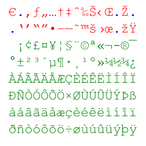
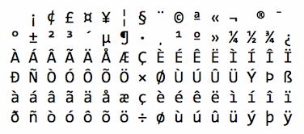
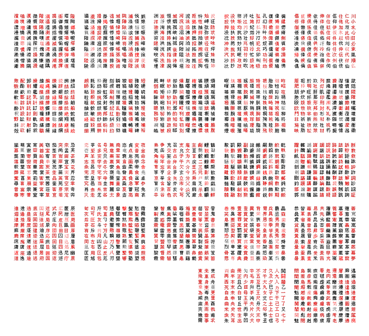

## **El ABCii de la codificación de caracteres en un sistema digital**

Para entender lo que son las distintas “codificaciones” de caracteres, hay que entender cómo se comunican las computadoras digitales internamente. Lo hacen en ceros y unos, es decir, en “_apagado_ y _prendido_".

La información digital es similar a la escritura fonética que usamos, sólo que imaginemos que únicamente tuviéramos dos caracteres para escribir: el espacio “ " (_apagado_), y el punto “.” (_prendido_). A la computadora cuando habla consigo misma esto no le importa, ya que su idioma es en “_apagado_ y _prendido_”. Pero nosotros tenemos que comunicarnos con la computadora y nosotros usamos letras, así que tenemos que traducir nuestras letras a “espacios y puntos”, comencemos:

<table width="400" cellpadding="4" cellspacing="0"><colgroup><col> <col> <col> <col> <col></colgroup>

<tbody>

<tr valign="top">

<th>

Alfabeto

</th>

<th>

A y P

</th>

<th>

Binario

</th>

<th>

Decimal

</th>

<th>

Bit Size

</th>

</tr>

<tr valign="top">

<td align="center">

a

</td>

<td align="right">

|.| &nbsp;

</td>

<td align="center">

1

</td>

<td align="center">

1

</td>

<td align="center">

1

</td>

</tr>

<tr valign="top">

<td align="center">

b

</td>

<td align="right">

|.&nbsp;| &nbsp;

</td>

<td align="center">

10

</td>

<td align="center">

2

</td>

<td align="center">

2

</td>

</tr>

<tr valign="top">

<td align="center">

c

</td>

<td align="right">

|..| &nbsp;

</td>

<td align="center">

11

</td>

<td align="center">

3

</td>

<td align="center">

2

</td>

</tr>

<tr valign="top">

<td align="center">

d

</td>

<td align="right">

|.&nbsp;&nbsp;| &nbsp;

</td>

<td align="center">

100

</td>

<td align="center">

4

</td>

<td align="center">

3

</td>

</tr>

<tr valign="top">

<td align="center">

e

</td>

<td align="right">

|.&nbsp;.| &nbsp;

</td>

<td align="center">

101

</td>

<td align="center">

5

</td>

<td align="center">

3

</td>

</tr>

<tr valign="top">

<td align="center">

f

</td>

<td align="right">

|..&nbsp;| &nbsp;

</td>

<td align="center">

110

</td>

<td align="center">

6

</td>

<td align="center">

3

</td>

</tr>

<tr valign="top">

<td align="center">

g

</td>

<td align="right">

|...| &nbsp;

</td>

<td align="center">

111

</td>

<td align="center">

7

</td>

<td align="center">

3

</td>

</tr>

<tr valign="top">

<td align="center">

h

</td>

<td align="right">

|.&nbsp;&nbsp;&nbsp;| &nbsp;

</td>

<td align="center">

1000

</td>

<td align="center">

8

</td>

<td align="center">

4

</td>

</tr>

<tr valign="top">

<td align="center">

i

</td>

<td align="right">

|.&nbsp;&nbsp;.| &nbsp;

</td>

<td align="center">

1001

</td>

<td align="center">

9

</td>

<td align="center">

4

</td>

</tr>

<tr valign="top">

<td align="center">

j

</td>

<td align="right">

|.&nbsp;.&nbsp;| &nbsp;

</td>

<td align="center">

1010

</td>

<td align="center">

10

</td>

<td align="center">

4

</td>

</tr>

<tr valign="top">

<td align="center">

k

</td>

<td align="right">

|.&nbsp;..| &nbsp;

</td>

<td align="center">

1011

</td>

<td align="center">

11

</td>

<td align="center">

4

</td>

</tr>

<tr valign="top">

<td align="center">

l

</td>

<td align="right">

|..&nbsp;&nbsp;| &nbsp;

</td>

<td align="center">

1100

</td>

<td align="center">

12

</td>

<td align="center">

4

</td>

</tr>

<tr valign="top">

<td align="center">

m

</td>

<td align="right">

|..&nbsp;.| &nbsp;

</td>

<td align="center">

1101

</td>

<td align="center">

13

</td>

<td align="center">

4

</td>

</tr>

<tr valign="top">

<td align="center">

n

</td>

<td align="center">

|...&nbsp;| &nbsp;

</td>

<td align="center">

1110

</td>

<td align="center">

14

</td>

<td align="center">

4

</td>

</tr>

<tr valign="top">

<td align="center">

ñ

</td>

<td align="center">

|....| &nbsp;

</td>

<td align="center">

1111

</td>

<td align="center">

15

</td>

<td align="center">

4

</td>

</tr>

<tr valign="top">

<td align="center">

Etc.

</td>

<td align="center"></td>

<td align="center"></td>

<td align="center"></td>

<td align="center"></td>

</tr>

</tbody>

</table>

En la tabla anterior notaremos que la manera de “codificar” nuestras letras no es otra cosa que pasarlas a **números binarios**. Y veremos que cuantas más letras agregamos, más “bits” necesitamos. Los *bits* son la cantidad de caracteres binarios que se necesitas para “escribir” un número. Pero también se nota que cada bit que agregamos “rinde más”, es decir, permite codificar más cantidad de letras.

Pero sería muy difícil escribir y luego poder leer palabras con varias letras seguidas en este sistema, no sabríamos dónde termina una letra y empieza la que sigue. Entonces se les ocurrió ir contando de 8 bits en 8 bits. El número máximo que se puede escribir en 8 bits es 11111111 (ocho unos), o sea, 255\. A eso los matemáticos les gusta escribirlo como **2⁸-1** , es decir, 2 multiplicado por sí mismo 8 veces (256), menos uno (255). Si le agregamos el 0, es decir que podemos empezar con espacio “ “, son 256, es decir que hay **2⁸** números (o posibilidades) en 8 bits contando el cero.

**Así que la cosa más o menos quedó como sigue:**

Con los primeros 32 números (5 bits, del 0 al 31, del 0 al 2⁵, o de 0 a 11111 en binario) lograron hacer un código para avisar algo así como “Ahí te va una letra”.

Del número 32 al 127 (los siguientes 2 bits, del 2⁵ al 2⁷, del 100000 al 1111111 en binario) asignaron a cada uno una letra, número y todos los signos más comunes de las máquinas de escribir en inglés que les cupieron muy a según su criterio (ver tabla más abajo).

Todavía les quedaba 1 bit que contenía OTROS 127 números posibles (del 128 al 255, del 2⁷ al 2⁸, del 1000000 al 11111111). Qué mejor que mandar OTRO carácter, ¡dos por el precio de uno!

A eso le llamaron ASCII.

## El juego de caracteres ASCII

**Año de creación:** 1963
**Nombre completo:** American Standard Code for Information Interchange  
**Acrónimos:** _ASCII_

*   ASCII usa los valores de 0 a 31 (y 127) para los caracteres de control.
*   ASCII usa los valores de 32 a 126 para letras, dígitos y símbolos.
*   ASCII actualmente ya no usa los valores de 128 a 255.

**Caracteres incluídos:**

## El juego de caracteres ANSI (Windows-1252)

**Año de creación:** 1980-1985
**Nombre completo:** Codificación de caracteres del alfabeto latino, usada por defecto por Microsoft Windows  
**Acrónimos:** Windows-1252 ó CP-1252\. Conocido históricamente como ANSI _Code Page_ o ACP

*   ANSI es idéntico a ASCII para los valores de 0 a 127.
*   ANSI tiene un conjunto de caracteres exclusivo para los valores de 128 a 159.
*   ANSI es idéntico a UTF-8 para los valores de 160 a 255.

**Caracteres incluídos** (además de ASCII)**:**

## El juego de caracteres ISO-8859-1

**Año de creación:** 1986_  
**Nombre completo:** Information technology — 8-bit single-byte coded graphic character set 1  
**Acrónimos:** _ISO-8859-1_

*   8859-1 es idéntico a ASCII para los valores de 0 a 127.
*   8859-1 no usa los valores de 128 a 159.
*   8859-1 es idéntico a UTF-8 para los valores de 160 a 255.

**Caracteres incluídos** (además de ASCII)**:**

## El conjunto de caracteres UTF-8

**Año de creación:** 1993_  
**Nombre completo:** Universal Coded Character Set de 8-bit  
**Acrónimos:** _UTF-8_

*   UTF-8 es idéntico a ASCII para los valores de 0 a 127.
*   UTF-8 no usa los valores de 128 a 159.
*   UTF-8 es idéntico tanto a ANSI como a 8859-1 para los valores de 160 a 255.

UTF-8 continúa desde el valor 256, es decir que no siempre usa un byte, sino que puede usar hasta 4 bytes, es decir un número binario de hasta 32 dígitos.

*   189 variedades para 1 byte
*   4096 variedades para 2 bytes: Se incluyen casi todos los alfabetos latinos, y también alfabetos griegos, cirílicos, coptos, armenios, hebreos, árabes, siríacos y tanas, así como la combinación de marcas diacríticas.
*   262144 variedades para 3 bytes: aquí se incluyen los caracteres chinos, japoneses, coreanos, etc.
*   Más de 130 millones de caracteres posibles en 4 bytes, emoticones, etc.: *UNICODE*.

**Caracteres incluídos** (ejemplo)**:**  
UTF-8 incluye muchísimos caracteres que no podemos mostrar aquí.  
Como ejemplo, mostraremos sólo los 2230 _kanjis_ japoneses más comunes actualmente (incluídos en UTF-8 de 3 bytes).

## Diferencias entre juegos de caracteres

La siguiente tabla muestra las diferencias entre los juegos de caracteres descritos anteriormente:

<table cellpadding="2" cellspacing="0">

<tbody>

<tr>

<th align="center">Num</th>

<th>ASCII</th>

<th>ANSI</th>

<th>8859</th>

<th>UTF-8</th>

<th>Descripción</th>

<th>Description</th>

</tr>

<tr>

<td align="center">32</td>

<td></td>

<td></td>

<td></td>

<td></td>

<td>espacio</td>

<td>space</td>

</tr>

<tr>

<td align="center">33</td>

<td>!</td>

<td>!</td>

<td>!</td>

<td>!</td>

<td>signo de exclamación</td>

<td>exclamation mark</td>

</tr>

<tr>

<td align="center">34</td>

<td>"</td>

<td>"</td>

<td>"</td>

<td>"</td>

<td>comillas</td>

<td>quotation mark</td>

</tr>

<tr>

<td align="center">35</td>

<td>#</td>

<td>#</td>

<td>#</td>

<td>#</td>

<td>símbolo de número</td>

<td>number sign</td>

</tr>

<tr>

<td align="center">36</td>

<td>$</td>

<td>$</td>

<td>$</td>

<td>$</td>

<td>signo de dólar</td>

<td>dollar sign</td>

</tr>

<tr>

<td align="center">37</td>

<td>%</td>

<td>%</td>

<td>%</td>

<td>%</td>

<td>signo de porcentaje</td>

<td>percent sign</td>

</tr>

<tr>

<td align="center">38</td>

<td>&</td>

<td>&</td>

<td>&</td>

<td>&</td>

<td>ampersand</td>

<td>ampersand</td>

</tr>

<tr>

<td align="center">39</td>

<td>'</td>

<td>'</td>

<td>'</td>

<td>'</td>

<td>apóstrofe</td>

<td>apostrophe</td>

</tr>

<tr>

<td align="center">40</td>

<td>(</td>

<td>(</td>

<td>(</td>

<td>(</td>

<td>paréntesis izquierdo</td>

<td>left parenthesis</td>

</tr>

<tr>

<td align="center">41</td>

<td>)</td>

<td>)</td>

<td>)</td>

<td>)</td>

<td>paréntesis derecho</td>

<td>right parenthesis</td>

</tr>

<tr>

<td align="center">42</td>

<td>*</td>

<td>*</td>

<td>*</td>

<td>*</td>

<td>asterisco</td>

<td>asterisk</td>

</tr>

<tr>

<td align="center">43</td>

<td>+</td>

<td>+</td>

<td>+</td>

<td>+</td>

<td>Signo de más</td>

<td>plus sign</td>

</tr>

<tr>

<td align="center">44</td>

<td>,</td>

<td>,</td>

<td>,</td>

<td>,</td>

<td>coma</td>

<td>comma</td>

</tr>

<tr>

<td align="center">45</td>

<td>-</td>

<td>-</td>

<td>-</td>

<td>-</td>

<td>guión-menos</td>

<td>hyphen-minus</td>

</tr>

<tr>

<td align="center">46</td>

<td>.</td>

<td>.</td>

<td>.</td>

<td>.</td>

<td>punto final</td>

<td>full stop</td>

</tr>

<tr>

<td align="center">47</td>

<td>/</td>

<td>/</td>

<td>/</td>

<td>/</td>

<td>división-barra</td>

<td>division-slash</td>

</tr>

<tr>

<td align="center">48</td>

<td>0</td>

<td>0</td>

<td>0</td>

<td>0</td>

<td>dígito cero</td>

<td>digit zero</td>

</tr>

<tr>

<td align="center">49</td>

<td>1</td>

<td>1</td>

<td>1</td>

<td>1</td>

<td>dígito uno</td>

<td>digit one</td>

</tr>

<tr>

<td align="center">50</td>

<td>2</td>

<td>2</td>

<td>2</td>

<td>2</td>

<td>dígito dos</td>

<td>digit two</td>

</tr>

<tr>

<td align="center">51</td>

<td>3</td>

<td>3</td>

<td>3</td>

<td>3</td>

<td>dígito tres</td>

<td>digit three</td>

</tr>

<tr>

<td align="center">52</td>

<td>4</td>

<td>4</td>

<td>4</td>

<td>4</td>

<td>dígito cuatro</td>

<td>digit four</td>

</tr>

<tr>

<td align="center">53</td>

<td>5</td>

<td>5</td>

<td>5</td>

<td>5</td>

<td>dígito cinco</td>

<td>digit five</td>

</tr>

<tr>

<td align="center">54</td>

<td>6</td>

<td>6</td>

<td>6</td>

<td>6</td>

<td>dígito seis</td>

<td>digit six</td>

</tr>

<tr>

<td align="center">55</td>

<td>7</td>

<td>7</td>

<td>7</td>

<td>7</td>

<td>dígito siete</td>

<td>digit seven</td>

</tr>

<tr>

<td align="center">56</td>

<td>8</td>

<td>8</td>

<td>8</td>

<td>8</td>

<td>dígito ocho</td>

<td>digit eight</td>

</tr>

<tr>

<td align="center">57</td>

<td>9</td>

<td>9</td>

<td>9</td>

<td>9</td>

<td>dígito nueve</td>

<td>digit nine</td>

</tr>

<tr>

<td align="center">58</td>

<td>:</td>

<td>:</td>

<td>:</td>

<td>:</td>

<td>dos puntos</td>

<td>colon</td>

</tr>

<tr>

<td align="center">59</td>

<td>;</td>

<td>;</td>

<td>;</td>

<td>;</td>

<td>punto y coma</td>

<td>semicolon</td>

</tr>

<tr>

<td align="center">60</td>

<td><</td>

<td><</td>

<td><</td>

<td><</td>

<td>menor que</td>

<td>less-than sign</td>

</tr>

<tr>

<td align="center">61</td>

<td>=</td>

<td>=</td>

<td>=</td>

<td>=</td>

<td>signo de igual</td>

<td>equals sign</td>

</tr>

<tr>

<td align="center">62</td>

<td>></td>

<td>></td>

<td>></td>

<td>></td>

<td>mayor que</td>

<td>greater-than sign</td>

</tr>

<tr>

<td align="center">63</td>

<td>?</td>

<td>?</td>

<td>?</td>

<td>?</td>

<td>signo de interrogación, cierre</td>

<td>question mark</td>

</tr>

<tr>

<td align="center">64</td>

<td>@</td>

<td>@</td>

<td>@</td>

<td>@</td>

<td>arroba</td>

<td>commercial at</td>

</tr>

<tr>

<td align="center">sesenta y cinco</td>

<td>A</td>

<td>A</td>

<td>A</td>

<td>A</td>

<td>Letra mayúscula latina A</td>

<td>Latin capital letter A</td>

</tr>

<tr>

<td align="center">66</td>

<td>B</td>

<td>B</td>

<td>B</td>

<td>B</td>

<td>Letra mayúscula latina B</td>

<td>Latin capital letter B</td>

</tr>

<tr>

<td align="center">67</td>

<td>C</td>

<td>C</td>

<td>C</td>

<td>C</td>

<td>Letra mayúscula latina C</td>

<td>Latin capital letter C</td>

</tr>

<tr>

<td align="center">68</td>

<td>D</td>

<td>D</td>

<td>D</td>

<td>D</td>

<td>Letra mayúscula latina D</td>

<td>Latin capital letter D</td>

</tr>

<tr>

<td align="center">69</td>

<td>E</td>

<td>E</td>

<td>E</td>

<td>E</td>

<td>Letra mayúscula latina E</td>

<td>Latin capital letter E</td>

</tr>

<tr>

<td align="center">70</td>

<td>F</td>

<td>F</td>

<td>F</td>

<td>F</td>

<td>Letra mayúscula latina F</td>

<td>Latin capital letter F</td>

</tr>

<tr>

<td align="center">71</td>

<td>G</td>

<td>G</td>

<td>G</td>

<td>G</td>

<td>Letra mayúscula latina G</td>

<td>Latin capital letter G</td>

</tr>

<tr>

<td align="center">72</td>

<td>H</td>

<td>H</td>

<td>H</td>

<td>H</td>

<td>Letra mayúscula latina H</td>

<td>Latin capital letter H</td>

</tr>

<tr>

<td align="center">73</td>

<td>I</td>

<td>I</td>

<td>I</td>

<td>I</td>

<td>Letra mayúscula latina I</td>

<td>Latin capital letter I</td>

</tr>

<tr>

<td align="center">74</td>

<td>J</td>

<td>J</td>

<td>J</td>

<td>J</td>

<td>Letra mayúscula latina J</td>

<td>Latin capital letter J</td>

</tr>

<tr>

<td align="center">75</td>

<td>K</td>

<td>K</td>

<td>K</td>

<td>K</td>

<td>Letra mayúscula latina K</td>

<td>Latin capital letter K</td>

</tr>

<tr>

<td align="center">76</td>

<td>L</td>

<td>L</td>

<td>L</td>

<td>L</td>

<td>Letra mayúscula latina L</td>

<td>Latin capital letter L</td>

</tr>

<tr>

<td align="center">77</td>

<td>M</td>

<td>M</td>

<td>M</td>

<td>M</td>

<td>Letra mayúscula latina M</td>

<td>Latin capital letter M</td>

</tr>

<tr>

<td align="center">78</td>

<td>N</td>

<td>N</td>

<td>N</td>

<td>N</td>

<td>Letra mayúscula latina N</td>

<td>Latin capital letter N</td>

</tr>

<tr>

<td align="center">79</td>

<td>O</td>

<td>O</td>

<td>O</td>

<td>O</td>

<td>Letra mayúscula latina O</td>

<td>Latin capital letter O</td>

</tr>

<tr>

<td align="center">80</td>

<td>P</td>

<td>P</td>

<td>P</td>

<td>P</td>

<td>Letra mayúscula latina P</td>

<td>Latin capital letter P</td>

</tr>

<tr>

<td align="center">81</td>

<td>Q</td>

<td>Q</td>

<td>Q</td>

<td>Q</td>

<td>Letra mayúscula latina Q</td>

<td>Latin capital letter Q</td>

</tr>

<tr>

<td align="center">82</td>

<td>R</td>

<td>R</td>

<td>R</td>

<td>R</td>

<td>Letra mayúscula latina R</td>

<td>Latin capital letter R</td>

</tr>

<tr>

<td align="center">83</td>

<td>S</td>

<td>S</td>

<td>S</td>

<td>S</td>

<td>Letra mayúscula latina S</td>

<td>Latin capital letter S</td>

</tr>

<tr>

<td align="center">84</td>

<td>T</td>

<td>T</td>

<td>T</td>

<td>T</td>

<td>Letra mayúscula latina T</td>

<td>Latin capital letter T</td>

</tr>

<tr>

<td align="center">85</td>

<td>U</td>

<td>U</td>

<td>U</td>

<td>U</td>

<td>Letra mayúscula latina U</td>

<td>Latin capital letter U</td>

</tr>

<tr>

<td align="center">86</td>

<td>V</td>

<td>V</td>

<td>V</td>

<td>V</td>

<td>Letra mayúscula latina V</td>

<td>Latin capital letter V</td>

</tr>

<tr>

<td align="center">87</td>

<td>W</td>

<td>W</td>

<td>W</td>

<td>W</td>

<td>Letra mayúscula latina W</td>

<td>Latin capital letter W</td>

</tr>

<tr>

<td align="center">88</td>

<td>X</td>

<td>X</td>

<td>X</td>

<td>X</td>

<td>Letra mayúscula latina X</td>

<td>Latin capital letter X</td>

</tr>

<tr>

<td align="center">89</td>

<td>Y</td>

<td>Y</td>

<td>Y</td>

<td>Y</td>

<td>Letra mayúscula latina Y</td>

<td>Latin capital letter Y</td>

</tr>

<tr>

<td align="center">90</td>

<td>Z</td>

<td>Z</td>

<td>Z</td>

<td>Z</td>

<td>Letra mayúscula latina Z</td>

<td>Latin capital letter Z</td>

</tr>

<tr>

<td align="center">91</td>

<td>[</td>

<td>[</td>

<td>[</td>

<td>[</td>

<td>corchete izquierdo</td>

<td>left square bracket</td>

</tr>

<tr>

<td align="center">92</td>

<td>\</td>

<td>\</td>

<td>\</td>

<td>\</td>

<td>barra invertida</td>

<td>reverse slash</td>

</tr>

<tr>

<td align="center">93</td>

<td>]</td>

<td>]</td>

<td>]</td>

<td>]</td>

<td>corchete derecho</td>

<td>right square bracket</td>

</tr>

<tr>

<td align="center">94</td>

<td>^</td>

<td>^</td>

<td>^</td>

<td>^</td>

<td>acento circunflejo</td>

<td>circumflex accent</td>

</tr>

<tr>

<td align="center">95</td>

<td>_</td>

<td>_</td>

<td>_</td>

<td>_</td>

<td>guión bajo</td>

<td>low line</td>

</tr>

<tr>

<td align="center">96</td>

<td>`</td>

<td>`</td>

<td>`</td>

<td>`</td>

<td>acento grave</td>

<td>grave accent</td>

</tr>

<tr>

<td align="center">97</td>

<td>a</td>

<td>a</td>

<td>a</td>

<td>a</td>

<td>Letra pequeña latina a</td>

<td>Latin small letter a</td>

</tr>

<tr>

<td align="center">98</td>

<td>b</td>

<td>b</td>

<td>b</td>

<td>b</td>

<td>Letra pequeña latina b</td>

<td>Latin small letter b</td>

</tr>

<tr>

<td align="center">99</td>

<td>c</td>

<td>c</td>

<td>c</td>

<td>c</td>

<td>Letra pequeña latina c</td>

<td>Latin small letter c</td>

</tr>

<tr>

<td align="center">100</td>

<td>d</td>

<td>d</td>

<td>d</td>

<td>d</td>

<td>Letra pequeña latina d</td>

<td>Latin small letter d</td>

</tr>

<tr>

<td align="center">101</td>

<td>e</td>

<td>e</td>

<td>e</td>

<td>e</td>

<td>Letra pequeña latina e</td>

<td>Latin small letter e</td>

</tr>

<tr>

<td align="center">102</td>

<td>f</td>

<td>f</td>

<td>f</td>

<td>f</td>

<td>Letra pequeña latina f</td>

<td>Latin small letter f</td>

</tr>

<tr>

<td align="center">103</td>

<td>g</td>

<td>g</td>

<td>g</td>

<td>g</td>

<td>Letra pequeña latina g</td>

<td>Latin small letter g</td>

</tr>

<tr>

<td align="center">104</td>

<td>h</td>

<td>h</td>

<td>h</td>

<td>h</td>

<td>Letra pequeña latina h</td>

<td>Latin small letter h</td>

</tr>

<tr>

<td align="center">105</td>

<td>i</td>

<td>i</td>

<td>i</td>

<td>i</td>

<td>Letra pequeña latina i</td>

<td>Latin small letter i</td>

</tr>

<tr>

<td align="center">106</td>

<td>j</td>

<td>j</td>

<td>j</td>

<td>j</td>

<td>Letra pequeña latina j</td>

<td>Latin small letter j</td>

</tr>

<tr>

<td align="center">107</td>

<td>k</td>

<td>k</td>

<td>k</td>

<td>k</td>

<td>Letra pequeña latina k</td>

<td>Latin small letter k</td>

</tr>

<tr>

<td align="center">108</td>

<td>l</td>

<td>l</td>

<td>l</td>

<td>l</td>

<td>Letra pequeña latina l</td>

<td>Latin small letter l</td>

</tr>

<tr>

<td align="center">109</td>

<td>m</td>

<td>m</td>

<td>m</td>

<td>m</td>

<td>Letra pequeña latina m</td>

<td>Latin small letter m</td>

</tr>

<tr>

<td align="center">110</td>

<td>n</td>

<td>n</td>

<td>n</td>

<td>n</td>

<td>Letra pequeña latina n</td>

<td>Latin small letter n</td>

</tr>

<tr>

<td align="center">111</td>

<td>o</td>

<td>o</td>

<td>o</td>

<td>o</td>

<td>Letra pequeña latina o</td>

<td>Latin small letter o</td>

</tr>

<tr>

<td align="center">112</td>

<td>p</td>

<td>p</td>

<td>p</td>

<td>p</td>

<td>Letra pequeña latina p</td>

<td>Latin small letter p</td>

</tr>

<tr>

<td align="center">113</td>

<td>q</td>

<td>q</td>

<td>q</td>

<td>q</td>

<td>Letra pequeña latina q</td>

<td>Latin small letter q</td>

</tr>

<tr>

<td align="center">114</td>

<td>r</td>

<td>r</td>

<td>r</td>

<td>r</td>

<td>Letra pequeña latina r</td>

<td>Latin small letter r</td>

</tr>

<tr>

<td align="center">115</td>

<td>s</td>

<td>s</td>

<td>s</td>

<td>s</td>

<td>Letra pequeña latina</td>

<td>Latin small letter s</td>

</tr>

<tr>

<td align="center">116</td>

<td>t</td>

<td>t</td>

<td>t</td>

<td>t</td>

<td>Letra pequeña latina t</td>

<td>Latin small letter t</td>

</tr>

<tr>

<td align="center">117</td>

<td>u</td>

<td>u</td>

<td>u</td>

<td>u</td>

<td>Letra pequeña latina u</td>

<td>Latin small letter u</td>

</tr>

<tr>

<td align="center">118</td>

<td>v</td>

<td>v</td>

<td>v</td>

<td>v</td>

<td>Letra pequeña latina v</td>

<td>Latin small letter v</td>

</tr>

<tr>

<td align="center">119</td>

<td>w</td>

<td>w</td>

<td>w</td>

<td>w</td>

<td>Letra pequeña latina w</td>

<td>Latin small letter w</td>

</tr>

<tr>

<td align="center">120</td>

<td>x</td>

<td>x</td>

<td>x</td>

<td>x</td>

<td>Letra pequeña latina x</td>

<td>Latin small letter x</td>

</tr>

<tr>

<td align="center">121</td>

<td>y</td>

<td>y</td>

<td>y</td>

<td>y</td>

<td>Letra pequeña latina y</td>

<td>Latin small letter y</td>

</tr>

<tr>

<td align="center">122</td>

<td>z</td>

<td>z</td>

<td>z</td>

<td>z</td>

<td>Letra pequeña latina z</td>

<td>Latin small letter z</td>

</tr>

<tr>

<td align="center">123</td>

<td>{</td>

<td>{</td>

<td>{</td>

<td>{</td>

<td>llave izquierda</td>

<td>left curly bracket</td>

</tr>

<tr>

<td align="center">124</td>

<td>|</td>

<td>|</td>

<td>|</td>

<td>|</td>

<td>barra vertical</td>

<td>vertical line</td>

</tr>

<tr>

<td align="center">125</td>

<td>}</td>

<td>}</td>

<td>}</td>

<td>}</td>

<td>llave derecha</td>

<td>right curly bracket</td>

</tr>

<tr>

<td align="center">126</td>

<td>~</td>

<td>~</td>

<td>~</td>

<td>~</td>

<td>tilde</td>

<td>tilde</td>

</tr>

<tr>

<td align="center">127</td>

<td>DEL</td>

<td></td>

<td></td>

<td></td>

<td></td>

<td></td>

</tr>

<tr>

<td align="center">128</td>

<td></td>

<td>€</td>

<td></td>

<td></td>

<td>signo del euro</td>

<td>euro sign</td>

</tr>

<tr>

<td align="center">129</td>

<td></td>

<td></td>

<td></td>

<td></td>

<td>NO UTILIZADO</td>

<td>NOT USED</td>

</tr>

<tr>

<td align="center">130</td>

<td></td>

<td>‚</td>

<td></td>

<td></td>

<td>Comilla baja simple</td>

<td>single low-9 quotation mark</td>

</tr>

<tr>

<td align="center">131</td>

<td></td>

<td>ƒ</td>

<td></td>

<td></td>

<td>Letra pequeña latina f con gancho</td>

<td>Latin small letter f with hook</td>

</tr>

<tr>

<td align="center">132</td>

<td></td>

<td>„</td>

<td></td>

<td></td>

<td>Comillas bajas dobles</td>

<td>double low-9 quotation mark</td>

</tr>

<tr>

<td align="center">133</td>

<td></td>

<td>…</td>

<td></td>

<td></td>

<td>elipsis horizontal</td>

<td>horizontal ellipsis</td>

</tr>

<tr>

<td align="center">134</td>

<td></td>

<td>†</td>

<td></td>

<td></td>

<td>daga</td>

<td>dagger</td>

</tr>

<tr>

<td align="center">135</td>

<td></td>

<td>‡</td>

<td></td>

<td></td>

<td>doble daga</td>

<td>double dagger</td>

</tr>

<tr>

<td align="center">136</td>

<td></td>

<td>ˆ</td>

<td></td>

<td></td>

<td>letra modificadora acento circunflejo</td>

<td>modifier letter circumflex accent</td>

</tr>

<tr>

<td align="center">137</td>

<td></td>

<td>‰</td>

<td></td>

<td></td>

<td>por millar</td>

<td>per mille sign</td>

</tr>

<tr>

<td align="center">138</td>

<td></td>

<td>Š</td>

<td></td>

<td></td>

<td>Letra mayúscula latina S con caron</td>

<td>Latin capital letter S with caron</td>

</tr>

<tr>

<td align="center">139</td>

<td></td>

<td>‹</td>

<td></td>

<td></td>

<td>comillas simples con ángulo hacia la izquierda</td>

<td>single left-pointing angle quotation mark</td>

</tr>

<tr>

<td align="center">140</td>

<td></td>

<td>Œ</td>

<td></td>

<td></td>

<td>Ligadura de capital latino OE</td>

<td>Latin capital ligature OE</td>

</tr>

<tr>

<td align="center">141</td>

<td></td>

<td></td>

<td></td>

<td></td>

<td>NO UTILIZADO</td>

<td>NOT USED</td>

</tr>

<tr>

<td align="center">142</td>

<td></td>

<td>Ž</td>

<td></td>

<td></td>

<td>Letra latina mayúscula Z con caron</td>

<td>Latin capital letter Z with caron</td>

</tr>

<tr>

<td align="center">143</td>

<td></td>

<td></td>

<td></td>

<td></td>

<td>NO UTILIZADO</td>

<td>NOT USED</td>

</tr>

<tr>

<td align="center">144</td>

<td></td>

<td></td>

<td></td>

<td></td>

<td>NO UTILIZADO</td>

<td>NOT USED</td>

</tr>

<tr>

<td align="center">145</td>

<td></td>

<td>‘</td>

<td></td>

<td></td>

<td>comilla simple izquierda</td>

<td>left single quotation mark</td>

</tr>

<tr>

<td align="center">146</td>

<td></td>

<td>’</td>

<td></td>

<td></td>

<td>comilla simple derecha</td>

<td>right single quotation mark</td>

</tr>

<tr>

<td align="center">147</td>

<td></td>

<td>“</td>

<td></td>

<td></td>

<td>dobles comillas derechas</td>

<td>left double quotation mark</td>

</tr>

<tr>

<td align="center">148</td>

<td></td>

<td>”</td>

<td></td>

<td></td>

<td>dobles comillas izquierdas</td>

<td>right double quotation mark</td>

</tr>

<tr>

<td align="center">149</td>

<td></td>

<td>•</td>

<td></td>

<td></td>

<td>bala</td>

<td>bullet</td>

</tr>

<tr>

<td align="center">150</td>

<td></td>

<td>–</td>

<td></td>

<td></td>

<td>guión inglés</td>

<td>en dash</td>

</tr>

<tr>

<td align="center">151</td>

<td></td>

<td>—</td>

<td></td>

<td></td>

<td>guión largo</td>

<td>em dash</td>

</tr>

<tr>

<td align="center">152</td>

<td></td>

<td>˜</td>

<td></td>

<td></td>

<td>pequeña tilde</td>

<td>small tilde</td>

</tr>

<tr>

<td align="center">153</td>

<td></td>

<td>™</td>

<td></td>

<td></td>

<td>signo de marca registrada</td>

<td>trade mark sign</td>

</tr>

<tr>

<td align="center">154</td>

<td></td>

<td>š</td>

<td></td>

<td></td>

<td>Letra pequeña latina s con caron</td>

<td>Latin small letter s with caron</td>

</tr>

<tr>

<td align="center">155</td>

<td></td>

<td>›</td>

<td></td>

<td></td>

<td>comilla sencilla de ángulo la derecha</td>

<td>single right-pointing angle quotation mark</td>

</tr>

<tr>

<td align="center">156</td>

<td></td>

<td>œ</td>

<td></td>

<td></td>

<td>Ligadura pequeña latina oe</td>

<td>Latin small ligature oe</td>

</tr>

<tr>

<td align="center">157</td>

<td></td>

<td></td>

<td></td>

<td></td>

<td>NO UTILIZADO</td>

<td>NOT USED</td>

</tr>

<tr>

<td align="center">158</td>

<td></td>

<td>ž</td>

<td></td>

<td></td>

<td>Letra pequeña latina z con caron</td>

<td>Latin small letter z with caron</td>

</tr>

<tr>

<td align="center">159</td>

<td></td>

<td>Ÿ</td>

<td></td>

<td></td>

<td>Letra mayúscula latina Y con diéresis</td>

<td>Latin capital letter Y with diaeresis</td>

</tr>

<tr>

<td align="center">160</td>

<td></td>

<td></td>

<td></td>

<td></td>

<td>espacio sin interrupción</td>

<td>no-break space</td>

</tr>

<tr>

<td align="center">161</td>

<td></td>

<td>¡</td>

<td>¡</td>

<td>¡</td>

<td>signo de exclamación apertura</td>

<td>inverted exclamation mark</td>

</tr>

<tr>

<td align="center">162</td>

<td></td>

<td>¢</td>

<td>¢</td>

<td>¢</td>

<td>signo de ciento</td>

<td>cent sign</td>

</tr>

<tr>

<td align="center">163</td>

<td></td>

<td>£</td>

<td>£</td>

<td>£</td>

<td>signo de Libra</td>

<td>pound sign</td>

</tr>

<tr>

<td align="center">164</td>

<td></td>

<td>¤</td>

<td>¤</td>

<td>¤</td>

<td>signo de moneda</td>

<td>currency sign</td>

</tr>

<tr>

<td align="center">165</td>

<td></td>

<td>¥</td>

<td>¥</td>

<td>¥</td>

<td>signo de yen</td>

<td>yen sign</td>

</tr>

<tr>

<td align="center">166</td>

<td></td>

<td>¦</td>

<td>¦</td>

<td>¦</td>

<td>barra rota</td>

<td>broken bar</td>

</tr>

<tr>

<td align="center">167</td>

<td></td>

<td>§</td>

<td>§</td>

<td>§</td>

<td>signo de sección</td>

<td>section sign</td>

</tr>

<tr>

<td align="center">168</td>

<td></td>

<td>¨</td>

<td>¨</td>

<td>¨</td>

<td>diéresis</td>

<td>diaeresis</td>

</tr>

<tr>

<td align="center">169</td>

<td></td>

<td>©</td>

<td>©</td>

<td>©</td>

<td>signo de copyright</td>

<td>copyright sign</td>

</tr>

<tr>

<td align="center">170</td>

<td></td>

<td>ª</td>

<td>ª</td>

<td>ª</td>

<td>indicador ordinal femenino</td>

<td>feminine ordinal indicator</td>

</tr>

<tr>

<td align="center">171</td>

<td></td>

<td>«</td>

<td>«</td>

<td>«</td>

<td>comillas españolas (de ángulo doble) izquierdas</td>

<td>left-pointing double angle quotation mark</td>

</tr>

<tr>

<td align="center">172</td>

<td></td>

<td>¬</td>

<td>¬</td>

<td>¬</td>

<td>singo notr</td>

<td>not sign</td>

</tr>

<tr>

<td align="center">173</td>

<td></td>

<td>­</td>

<td>­</td>

<td>­</td>

<td>guión suave</td>

<td>soft hyphen</td>

</tr>

<tr>

<td align="center">174</td>

<td></td>

<td>®</td>

<td>®</td>

<td>®</td>

<td>signo registrado</td>

<td>registered sign</td>

</tr>

<tr>

<td align="center">175</td>

<td></td>

<td>¯</td>

<td>¯</td>

<td>¯</td>

<td>macron</td>

<td>macron</td>

</tr>

<tr>

<td align="center">176</td>

<td></td>

<td>°</td>

<td>°</td>

<td>°</td>

<td>signo de grado</td>

<td>degree sign</td>

</tr>

<tr>

<td align="center">177</td>

<td></td>

<td>±</td>

<td>±</td>

<td>±</td>

<td>signo más-menos</td>

<td>plus-minus sign</td>

</tr>

<tr>

<td align="center">178</td>

<td></td>

<td>²</td>

<td>²</td>

<td>²</td>

<td>superíndice dos</td>

<td>superscript two</td>

</tr>

<tr>

<td align="center">179</td>

<td></td>

<td>³</td>

<td>³</td>

<td>³</td>

<td>superíndice tres</td>

<td>superscript three</td>

</tr>

<tr>

<td align="center">180</td>

<td></td>

<td>´</td>

<td>´</td>

<td>´</td>

<td>acento agudo</td>

<td>acute accent</td>

</tr>

<tr>

<td align="center">181</td>

<td></td>

<td>µ</td>

<td>µ</td>

<td>µ</td>

<td>micro signo</td>

<td>micro sign</td>

</tr>

<tr>

<td align="center">182</td>

<td></td>

<td>¶</td>

<td>¶</td>

<td>¶</td>

<td>signo de pilcrow</td>

<td>pilcrow sign</td>

</tr>

<tr>

<td align="center">183</td>

<td></td>

<td>·</td>

<td>·</td>

<td>·</td>

<td>punto medio</td>

<td>middle dot</td>

</tr>

<tr>

<td align="center">184</td>

<td></td>

<td>¸</td>

<td>¸</td>

<td>¸</td>

<td>cedilla</td>

<td>cedilla</td>

</tr>

<tr>

<td align="center">185</td>

<td></td>

<td>¹</td>

<td>¹</td>

<td>¹</td>

<td>superíndice uno</td>

<td>superscript one</td>

</tr>

<tr>

<td align="center">186</td>

<td></td>

<td>º</td>

<td>º</td>

<td>º</td>

<td>indicador ordinal masculino</td>

<td>masculine ordinal indicator</td>

</tr>

<tr>

<td align="center">187</td>

<td></td>

<td>»</td>

<td>»</td>

<td>»</td>

<td>comillas españolas (de ángulo doble) derechas</td>

<td>right-pointing double angle quotation mark</td>

</tr>

<tr>

<td align="center">188</td>

<td></td>

<td>¼</td>

<td>¼</td>

<td>¼</td>

<td>fracción vulgar un cuarto</td>

<td>vulgar fraction one quarter</td>

</tr>

<tr>

<td align="center">189</td>

<td></td>

<td>½</td>

<td>½</td>

<td>½</td>

<td>fracción vulgar una mitad</td>

<td>vulgar fraction one half</td>

</tr>

<tr>

<td align="center">190</td>

<td></td>

<td>¾</td>

<td>¾</td>

<td>¾</td>

<td>fracción vulgar tres cuartos</td>

<td>vulgar fraction three quarters</td>

</tr>

<tr>

<td align="center">191</td>

<td></td>

<td>¿</td>

<td>¿</td>

<td>¿</td>

<td>signo de interrogación invertido</td>

<td>inverted question mark</td>

</tr>

<tr>

<td align="center">192</td>

<td></td>

<td>À</td>

<td>À</td>

<td>À</td>

<td>Letra mayúscula latina A con acento grave</td>

<td>Latin capital letter A with grave</td>

</tr>

<tr>

<td align="center">193</td>

<td></td>

<td>Á</td>

<td>Á</td>

<td>Á</td>

<td>Letra mayúscula latina A con acento agudo</td>

<td>Latin capital letter A with acute</td>

</tr>

<tr>

<td align="center">194</td>

<td></td>

<td>Â</td>

<td>Â</td>

<td>Â</td>

<td>Letra mayúscula latina A con circunflejo</td>

<td>Latin capital letter A with circumflex</td>

</tr>

<tr>

<td align="center">195</td>

<td></td>

<td>Ã</td>

<td>Ã</td>

<td>Ã</td>

<td>Letra latina mayúscula A con tilde</td>

<td>Latin capital letter A with tilde</td>

</tr>

<tr>

<td align="center">196</td>

<td></td>

<td>Ä</td>

<td>Ä</td>

<td>Ä</td>

<td>Letra latina mayúscula A con diéresis</td>

<td>Latin capital letter A with diaeresis</td>

</tr>

<tr>

<td align="center">197</td>

<td></td>

<td>Å</td>

<td>Å</td>

<td>Å</td>

<td>Letra mayúscula latina A con anillo arriba</td>

<td>Latin capital letter A with ring above</td>

</tr>

<tr>

<td align="center">198</td>

<td></td>

<td>Æ</td>

<td>Æ</td>

<td>Æ</td>

<td>Letra mayúscula latina AE</td>

<td>Latin capital letter AE</td>

</tr>

<tr>

<td align="center">199</td>

<td></td>

<td>Ç</td>

<td>Ç</td>

<td>Ç</td>

<td>Letra latina mayúscula C con cedilla</td>

<td>Latin capital letter C with cedilla</td>

</tr>

<tr>

<td align="center">200</td>

<td></td>

<td>È</td>

<td>È</td>

<td>È</td>

<td>Letra mayúscula latina E con acento grave</td>

<td>Latin capital letter E with grave</td>

</tr>

<tr>

<td align="center">201</td>

<td></td>

<td>É</td>

<td>É</td>

<td>É</td>

<td>Letra mayúscula latina E con letra aguda</td>

<td>Latin capital letter E with acute</td>

</tr>

<tr>

<td align="center">202</td>

<td></td>

<td>Ê</td>

<td>Ê</td>

<td>Ê</td>

<td>Letra mayúscula latina E con circunflejo</td>

<td>Latin capital letter E with circumflex</td>

</tr>

<tr>

<td align="center">203</td>

<td></td>

<td>Ë</td>

<td>Ë</td>

<td>Ë</td>

<td>Letra latina mayúscula E con diéresis</td>

<td>Latin capital letter E with diaeresis</td>

</tr>

<tr>

<td align="center">204</td>

<td></td>

<td>Ì</td>

<td>Ì</td>

<td>Ì</td>

<td>Letra mayúscula latina con acento grave</td>

<td>Latin capital letter I with grave</td>

</tr>

<tr>

<td align="center">205</td>

<td></td>

<td>Í</td>

<td>Í</td>

<td>Í</td>

<td>Letra mayúscula latina I con acento agudo</td>

<td>Latin capital letter I with acute</td>

</tr>

<tr>

<td align="center">206</td>

<td></td>

<td>Î</td>

<td>Î</td>

<td>Î</td>

<td>Letra mayúscula latina con circunflejo</td>

<td>Latin capital letter I with circumflex</td>

</tr>

<tr>

<td align="center">207</td>

<td></td>

<td>Ï</td>

<td>Ï</td>

<td>Ï</td>

<td>Letra mayúscula latina con diéresis</td>

<td>Latin capital letter I with diaeresis</td>

</tr>

<tr>

<td align="center">208</td>

<td></td>

<td>Ð</td>

<td>Ð</td>

<td>Ð</td>

<td>Letra mayúscula latina Eth</td>

<td>Latin capital letter Eth</td>

</tr>

<tr>

<td align="center">209</td>

<td></td>

<td>Ñ</td>

<td>Ñ</td>

<td>Ñ</td>

<td>Letra latina mayúscula eñe</td>

<td>Latin capital letter N with tilde</td>

</tr>

<tr>

<td align="center">210</td>

<td></td>

<td>Ò</td>

<td>Ò</td>

<td>Ò</td>

<td>Letra mayúscula latina O con acento grave</td>

<td>Latin capital letter O with grave</td>

</tr>

<tr>

<td align="center">211</td>

<td></td>

<td>Ó</td>

<td>Ó</td>

<td>Ó</td>

<td>Letra mayúscula latina O con acento agudo</td>

<td>Latin capital letter O with acute</td>

</tr>

<tr>

<td align="center">212</td>

<td></td>

<td>Ô</td>

<td>Ô</td>

<td>Ô</td>

<td>Letra latina mayúscula O con circunflejo</td>

<td>Latin capital letter O with circumflex</td>

</tr>

<tr>

<td align="center">213</td>

<td></td>

<td>Õ</td>

<td>Õ</td>

<td>Õ</td>

<td>Letra mayúscula latina O con tilde</td>

<td>Latin capital letter O with tilde</td>

</tr>

<tr>

<td align="center">214</td>

<td></td>

<td>Ö</td>

<td>Ö</td>

<td>Ö</td>

<td>Letra latina mayúscula O con diéresis</td>

<td>Latin capital letter O with diaeresis</td>

</tr>

<tr>

<td align="center">215</td>

<td></td>

<td>×</td>

<td>×</td>

<td>×</td>

<td>signo de multiplicación</td>

<td>multiplication sign</td>

</tr>

<tr>

<td align="center">216</td>

<td></td>

<td>Ø</td>

<td>Ø</td>

<td>Ø</td>

<td>Letra mayúscula latina O con barra</td>

<td>Latin capital letter O with stroke</td>

</tr>

<tr>

<td align="center">217</td>

<td></td>

<td>Ù</td>

<td>Ù</td>

<td>Ù</td>

<td>Letra mayúscula latina U con acento grave</td>

<td>Latin capital letter U with grave</td>

</tr>

<tr>

<td align="center">218</td>

<td></td>

<td>Ú</td>

<td>Ú</td>

<td>Ú</td>

<td>Letra mayúscula latina U con letra aguda</td>

<td>Latin capital letter U with acute</td>

</tr>

<tr>

<td align="center">219</td>

<td></td>

<td>Û</td>

<td>Û</td>

<td>Û</td>

<td>Letra mayúscula latina U con circunflejo</td>

<td>Latin capital letter U with circumflex</td>

</tr>

<tr>

<td align="center">220</td>

<td></td>

<td>Ü</td>

<td>Ü</td>

<td>Ü</td>

<td>Letra mayúscula latina U con diéresis</td>

<td>Latin capital letter U with diaeresis</td>

</tr>

<tr>

<td align="center">221</td>

<td></td>

<td>Ý</td>

<td>Ý</td>

<td>Ý</td>

<td>Letra mayúscula latina Y con acento agudo</td>

<td>Latin capital letter Y with acute</td>

</tr>

<tr>

<td align="center">222</td>

<td></td>

<td>Þ</td>

<td>Þ</td>

<td>Þ</td>

<td>Letra mayúscula latina Thorn</td>

<td>Latin capital letter Thorn</td>

</tr>

<tr>

<td align="center">223</td>

<td></td>

<td>ß</td>

<td>ß</td>

<td>ß</td>

<td>Letra pequeña latina aguda s</td>

<td>Latin small letter sharp s</td>

</tr>

<tr>

<td align="center">224</td>

<td></td>

<td>à</td>

<td>à</td>

<td>à</td>

<td>Letra pequeña latina a con acento grave</td>

<td>Latin small letter a with grave</td>

</tr>

<tr>

<td align="center">225</td>

<td></td>

<td>á</td>

<td>á</td>

<td>á</td>

<td>Letra pequeña latina a con acento agudo</td>

<td>Latin small letter a with acute</td>

</tr>

<tr>

<td align="center">226</td>

<td></td>

<td>â</td>

<td>â</td>

<td>â</td>

<td>Letra pequeña latina a con circunflejo</td>

<td>Latin small letter a with circumflex</td>

</tr>

<tr>

<td align="center">227</td>

<td></td>

<td>ã</td>

<td>ã</td>

<td>ã</td>

<td>Letra pequeña latina a con tilde</td>

<td>Latin small letter a with tilde</td>

</tr>

<tr>

<td align="center">228</td>

<td></td>

<td>ä</td>

<td>ä</td>

<td>ä</td>

<td>Letra pequeña latina a con diéresis</td>

<td>Latin small letter a with diaeresis</td>

</tr>

<tr>

<td align="center">229</td>

<td></td>

<td>å</td>

<td>å</td>

<td>å</td>

<td>Letra pequeña latina a con anillo arriba</td>

<td>Latin small letter a with ring above</td>

</tr>

<tr>

<td align="center">230</td>

<td></td>

<td>æ</td>

<td>æ</td>

<td>æ</td>

<td>Letra pequeña latina ae</td>

<td>Latin small letter ae</td>

</tr>

<tr>

<td align="center">231</td>

<td></td>

<td>ç</td>

<td>ç</td>

<td>ç</td>

<td>Letra pequeña latina c con cedilla</td>

<td>Latin small letter c with cedilla</td>

</tr>

<tr>

<td align="center">232</td>

<td></td>

<td>è</td>

<td>è</td>

<td>è</td>

<td>Letra pequeña latina e con acento grave</td>

<td>Latin small letter e with grave</td>

</tr>

<tr>

<td align="center">233</td>

<td></td>

<td>é</td>

<td>é</td>

<td>é</td>

<td>Letra pequeña latina e con acento agudo</td>

<td>Latin small letter e with acute</td>

</tr>

<tr>

<td align="center">234</td>

<td></td>

<td>ê</td>

<td>ê</td>

<td>ê</td>

<td>Letra pequeña latina e con circunflejo</td>

<td>Latin small letter e with circumflex</td>

</tr>

<tr>

<td align="center">235</td>

<td></td>

<td>ë</td>

<td>ë</td>

<td>ë</td>

<td>Letra pequeña latina e con diéresis</td>

<td>Latin small letter e with diaeresis</td>

</tr>

<tr>

<td align="center">236</td>

<td></td>

<td>ì</td>

<td>ì</td>

<td>ì</td>

<td>Letra pequeña latina i con acento grave</td>

<td>Latin small letter i with grave</td>

</tr>

<tr>

<td align="center">237</td>

<td></td>

<td>í</td>

<td>í</td>

<td>í</td>

<td>Letra pequeña latina i con acento agudo</td>

<td>Latin small letter i with acute</td>

</tr>

<tr>

<td align="center">238</td>

<td></td>

<td>î</td>

<td>î</td>

<td>î</td>

<td>Letra pequeña latina i con circunflejo</td>

<td>Latin small letter i with circumflex</td>

</tr>

<tr>

<td align="center">239</td>

<td></td>

<td>ï</td>

<td>ï</td>

<td>ï</td>

<td>Letra pequeña latina i con diéresis</td>

<td>Latin small letter i with diaeresis</td>

</tr>

<tr>

<td align="center">240</td>

<td></td>

<td>ð</td>

<td>ð</td>

<td>ð</td>

<td>Letra pequeña latina eth</td>

<td>Latin small letter eth</td>

</tr>

<tr>

<td align="center">241</td>

<td></td>

<td>ñ</td>

<td>ñ</td>

<td>ñ</td>

<td>Letra pequeña latina eñe</td>

<td>Latin small letter n with tilde</td>

</tr>

<tr>

<td align="center">242</td>

<td></td>

<td>ò</td>

<td>ò</td>

<td>ò</td>

<td>Letra pequeña latina o con acento grave</td>

<td>Latin small letter o with grave</td>

</tr>

<tr>

<td align="center">243</td>

<td></td>

<td>ó</td>

<td>ó</td>

<td>ó</td>

<td>Letra pequeña latina o con acento agudo</td>

<td>Latin small letter o with acute</td>

</tr>

<tr>

<td align="center">244</td>

<td></td>

<td>ô</td>

<td>ô</td>

<td>ô</td>

<td>Letra pequeña latina o con circunflejo</td>

<td>Latin small letter o with circumflex</td>

</tr>

<tr>

<td align="center">245</td>

<td></td>

<td>õ</td>

<td>õ</td>

<td>õ</td>

<td>Letra pequeña latina o con tilde</td>

<td>Latin small letter o with tilde</td>

</tr>

<tr>

<td align="center">246</td>

<td></td>

<td>ö</td>

<td>ö</td>

<td>ö</td>

<td>Letra pequeña latina o con diéresis</td>

<td>Latin small letter o with diaeresis</td>

</tr>

<tr>

<td align="center">247</td>

<td></td>

<td>÷</td>

<td>÷</td>

<td>÷</td>

<td>signo de división</td>

<td>division sign</td>

</tr>

<tr>

<td align="center">248</td>

<td></td>

<td>ø</td>

<td>ø</td>

<td>ø</td>

<td>Letra pequeña latina o con barra</td>

<td>Latin small letter o with stroke</td>

</tr>

<tr>

<td align="center">249</td>

<td></td>

<td>ù</td>

<td>ù</td>

<td>ù</td>

<td>Letra pequeña latina u con acento grave</td>

<td>Latin small letter u with grave</td>

</tr>

<tr>

<td align="center">250</td>

<td></td>

<td>ú</td>

<td>ú</td>

<td>ú</td>

<td>Letra pequeña latina u con agudo</td>

<td>Latin small letter u with acute</td>

</tr>

<tr>

<td align="center">251</td>

<td></td>

<td>û</td>

<td>û</td>

<td>û</td>

<td>Letra pequeña latina con circunflejo</td>

<td>Latin small letter with circumflex</td>

</tr>

<tr>

<td align="center">252</td>

<td></td>

<td>ü</td>

<td>ü</td>

<td>ü</td>

<td>Letra pequeña latina u con diéresis</td>

<td>Latin small letter u with diaeresis</td>

</tr>

<tr>

<td align="center">253</td>

<td></td>

<td>ý</td>

<td>ý</td>

<td>ý</td>

<td>Letra pequeña latina y con acento agudo</td>

<td>Latin small letter y with acute</td>

</tr>

<tr>

<td align="center">254</td>

<td></td>

<td>þ</td>

<td>þ</td>

<td>þ</td>

<td>Letra griega sho o islandesa thorn</td>

<td>Latin small letter thorn</td>

</tr>

<tr>

<td align="center">255</td>

<td></td>

<td>ÿ</td>

<td>ÿ</td>

<td>ÿ</td>

<td>Letra pequeña latina y con diéresis</td>

<td>Latin small letter y with diaeresis</td>

</tr>

</tbody>

</table>