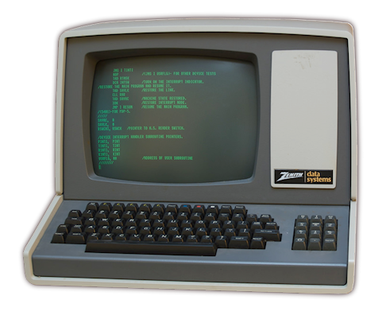
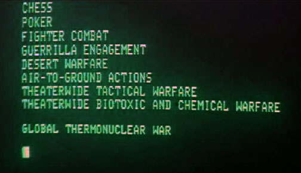
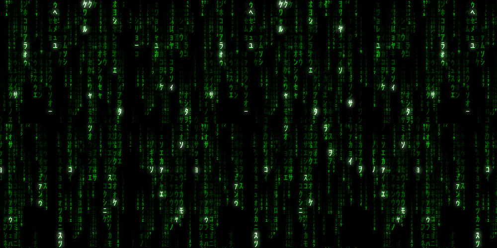
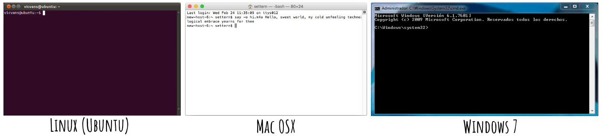

# En el principio fue la línea de comandos
### Curso básico de uso de la terminal o consola.

## 0. La línea de comandos

*[En el principio fue la línea de comandos](https://www.traficantes.net/sites/default/files/pdfs/En%20el%20principio%20fue...-TdS.pdf)* es el título de un libro de **[Neal Stephenson](https://es.wikipedia.org/wiki/Neal_Stephenson)** que leí hace muchos años. Ahora que he vuelto a dar clases de programación a "principiantes" me doy cuenta de lo importante que fue ese libro para mí y cómo ayudó a definir -junto con los [sesudos artículos](https://www.gnu.org/philosophy/fsfs/rms-essays.pdf) de **[Richard Stallman](https://es.wikipedia.org/wiki/Richard_Stallman)**- una especie de *ética hacker* que tantos *coders* del mundo todavía comparten. No sólo se trata de que todos podemos usar software que hacemos entre todos (o pirateamos), como una especie de "bien común", libre y gratuito. Además se trata de **no ocultar tanto las tripas del monstruo**.

No todo mundo sabe -pero debería saberlo- que hay muchos programas que hacen que una computadora "haga algo". Es decir que las computadoras sólo saben hacer lo que alguien les haya explicado exactamente cómo se hace, en su propio **[lenguaje de máquina](https://es.wikipedia.org/wiki/Lenguaje_de_m%C3%A1quina)**. Por suerte para nosotros ya hubo gente que escribió [intérpretes](https://es.wikipedia.org/wiki/Int%C3%A9rprete_(inform%C3%A1tica)) y [compiladores](https://es.wikipedia.org/wiki/Compilador)  que traducen entre ese lenguaje oscuro y unos lenguajes que se parecen más a los nuestros. Por suerte también ya se han escrito los [programas](https://es.wikipedia.org/wiki/Programa_inform%C3%A1tico) que hacen las cosas más básicas necesarias para construir programas más divertidos sobre ellas. No es necesario definirle a la computadora todos los signos escritos de nuestro idioma, cómo son, cuáles forman palabras (abcde...) y en qué orden nos gustan y cuáles las separan o no forman parte de las palabras ( ,.¡#$...), cuáles son números (01234...), etc. Tampoco le tenemos que enseñar la suma o la resta, y miles y millones de cosas más que alguien ya le enseñó a hacer a "las computadoras". Todo ese conocimiento acumulado se distribuye en paquetes llamados [Sistemas Operativos](https://es.wikipedia.org/wiki/Sistema_operativo) que no son más que todos esos pequeños programas que "hacen cosas" organizados, empacados y distribuidos comercial o gratuitamente. Es decir que parece que son *una sola cosa* pero en realidad son *muchas* actuando en serie o en paralelo, muchas veces en concordancia y otras veces no tanto.
Los sistemas operativos varían según el tipo de computadora para la que están hechos. Las computadoras más comunes que usamos los mortales hasta la fecha (2017) son las llamadas simplemente "computadoras" y los llamados "celulares inteligentes".

**Celulares y _tablets_**

Para los "celulares inteligentes" y las "tabletas" existen dos muy conocidos (y muchos nuevos que están apareciendo).

1. **IOS**. Para el IPhone e IPad.

1. **Android**. Para casi todos los demás.

En estos sistemas es difícil acceder a la **línea de comandos** e incluso puede ser "ilegal" usarla de ciertas formas.

**Computadoras de escritorio y _laptops_**

Para las "computadoras normales", tanto de "escritorio" (que son las grandotas) como las "laptop" que son las portátiles, hay tres sistemas operativos básicos, cada uno con sus variantes y versiones:

1. **OSX**. Para las computadoras de la marca Apple.

1. **Windows**. Para la mayoría de las computadoras.

1. **Linux**. Para *todas* las computadoras.

En estas computadoras la terminal siempre está ahí pero en el caso de Mac y Windows -e incluso en algunas versiones de Linux- la terminal está bastante oculta y pasa desapercibida para la mayoría de los usuarios.

## 1. ¿Qué es la terminal?

Entonces, ¿qué diablos es eso de la "terminal" o la "consola" y para qué sirve? Es una pregunta que para muchos puede parecer ociosa o simplemente anacrónica. No por eso no intentaremos responderla aquí.

**La terminal es un programa que ofrece una línea de comandos que sirve para ejecutar otros programas.**

La primera interfaz realmente útil que permitió a *los pioneros* adentrarse en el "maravilloso mundo de las computadoras".



Existe un pequeño programa que se comporta como las terminales originales y todavía vemos en algunas películas de *hackers*. Una ventana de fondo negro (a veces ocupa toda la pantalla) en la que aparecen palabras y signos incomprensibles, normalmente en color verde, y donde el *hacker* ingresa (adivinando) el *password* de acceso a las computadoras que controlan las armas nucleares del Pentágono.



*Juegos de Guerra (War Games), 1983*

Incluso en las producciones no tan viejas, como la trilogía **Matrix**, todavía quedan reminiscencias de esa terminal de fondo negro y letras verdes.



*Matrix, 1999*

Sin duda la permanencia de las letras verdes y el fondo negro es enteramente una cuestión de estilo y nostalgia, o bien una necesidad de referencia, tal como el **símbolo de guardar** en las computadoras actuales sigue siendo la imagen de un objeto que sólo existió por un breve período de tiempo: el *diskette* o disquete de 3 1/2. 


### Nostalgia por la escritura

Pero la terminal no es sólo una interfaz primitiva y oscura, es también la herramienta que permite relacionarnos de manera más directa con los ordenadores. Entre nosotros y los ordenadores está todavía una herramienta mucho más antigua que no creo que debamos abandonar todavía: la escritura fonética.

De hecho no parece que estemos por abandonar ninguna de las dos cuando la *página web* más usada actualmente en todo el mundo se parece mucho a una línea de comandos.


De hecho, la consola de búsqueda de *Google* hace más que sólo buscar.

Se pueden hacer operaciones matemáticas simples, como:

> **[(111.108055514^2)/(90000+9999)](goo.gl/ASVbZc)**

Se pueden hacer conversiones de monedas o medidas:

> **[33 c to f](http://google.com/search?q=33+c+to+f)**
> **[200 usd to mxn](http://google.com/search?q=200+USD+to+MXN)**

Cuando buscamos archivos en nuestra computadora personal, buscamos a veces dentro de una carpeta, en *Google* podemos buscar sólo dentro de una página usando el *argumento* **site:**.

> **[site:lengua.la música para descargar](http://google.com/search?q=site%3Alengua.la+música+para+descargar)**

Nótese que los espacios "separan argumentos" así que **site:** sólo afecta a **lengua.la**, y las siguientes palabras son las que se buscarán en ese sitio: **música para descargar**.

También podemos buscar archivos por su contenido o por el nombre del archivo. En *Google* por *default* buscamos en los contenidos, pero podemos buscar en el "nombre del archivo", en este caso la [URL](https://es.wikipedia.org/wiki/Localizador_de_recursos_uniforme) de la página, con el *argumento* **inurl:**.

> **[inurl:cancionero Eduardo Mateo](http://google.com/search?q=inurl%3ACancionero+Eduardo+Mateo)**

En este ejemplo buscamos las palabras: **Eduardo Mateo** en todas las páginas que tengan en su URL la palabra **cancionero**.

Podemos buscar por el tipo de archivo con el *argumento* **filetype:**, por ejemplo podemos buscar el PDF del libro *La peste escarlata* de Jack London:

> **[filetype:pdf "La peste escarlata"](http://google.com/search?q=filetype%3Apdf+"La+peste+escarlata")**

También tenemos otras opciones de búsqueda muy útiles como las comillas. Cuando buscamos las palabras **[Francis Bacon](http://www.google.com/search?q=Francis+Bacon)** en *Google*, encontramos 40 millones de resultados, pero si buscamos **["Francis Bacon"](http://www.google.com/search?q="Francis+Bacon")** (entre comillas) sólo encuentra 10 millones de resultados. Es decir que ha omitido todos los resultados que mencionan a otros **Francis** o al **_Bacon_** (tocino).

Qué pasa si queremos resultados del pintor del siglo XX y no del filósofo del siglo XVI. Podemos agregar la palabra pintor:

> **["Francis Bacon" pintor](http://www.google.com/search?q="Francis+Bacon"+pintor)**

Pero también podemos (y resulta muy útil en algunos casos) pedirle a *Google* que omita todos los resultados que incluyen la palabra **filósofo** con el signo de menos (**-**):

> **["Francis Bacon" -filósofo](http://www.google.com/search?q="Francis+Bacon"+-filósofo)**

 - **Mira el archivo [BuscarEnGoogle.md](BuscarEnGoogle.md) para una referencia más completa de búsqueda avanzada en Google**

Ni *Windows* ni *Mac* ofrecen esa simple funcionalidad claramente,e incluso ocultan la herramienta que permite hacer todo eso y mucho mucho más en nuestros archivos personales. Simplemente fingen que no está ahí, pero en realidad es muy fácil ejecutarla para el que sabe que existe, y ninguna computadora decente se vendería en el mundo de los usuarios avanzados si no tuviera terminal, incluso si no pudiéramos ejecutarla desde el teclado sin ayuda del ratón o *mouse*, que es la forma elegante de hacerlo.

## 2. ¿Cómo ejecutar la terminal?

Las terminales pueden verse muy diferentes según el sistema operativo y también se comportan un poco diferente.



Para iniciar la terminal (sin necesidad del uso del *mouse*) debemos seguir estos pasos, según el sistema operativo:

### Ejecutar terminal en Linux

1. Aprieta **[Control] + [Alt] + T**

### Ejecutar terminal en Windows

1. Aprieta **[WinKey] + R** para abrir la consola de ejecución de Windows.

1. Escribe **cmd**

1. Por último aprieta **[Enter]**

Para un atajo mejor debes crear un acceso directo a **cmd.exe** (puede ser en el escritorio, en la barra de tareas, etc.), clika con botón derecho sobre el acceso que creaste, selecciona *propiedades* y luego asigna un "método de teclado abreviado": Si aprietas la tecla "T" y se asignará la combinación **[Control] + [Alt] + T** como atajo para abrir una terminal.

En Windows 8+ se puede usar **[WinKey] + X** y luego **C**.

### Ejecutar terminal en Mac (OSX)

1. Aprieta **[MacKey] + [Espacio]** para abrir la búsqueda (spotlight) de Mac.

1. Escribe **terminal**

1. Por último aprieta **[Enter]**

Para crear un atajo directo puedes usar [este programa](https://pqrs.org/osx/karabiner/).

En algunas versiones más recientes de Mac se puede ejecutar la terminal con **[MacKey] + T**.

### Configurar mi terminal o usar otras versiones a las *default*

Las terminales son diferentes en cada sistema y ahora se pueden configurar con cualquier combinación de colores. Además hay muchas terminales que podemos usar en vez de las que nos ofrece el sistema operativo por *default*.

En **Mac** se puede usar [iTerm2](https://www.iterm2.com/), en **Windows** puedes usar [PowerSell](https://docs.microsoft.com/en-us/powershell/) o [Cmder](http://cmder.net/) y **Linux** tiene las mejores y hay cientos para escoger como: [Guake](http://guake-project.org/), [Terminator](https://gnometerminator.blogspot.mx/), [Terminology](https://www.enlightenment.org/about-terminology), etc.

## Mínimos conocimientos sobre un ordenador

**Un ordenador tiene tres partes principales** y conviene entender en términos generales qué son y cómo funcionan.

1. **En primer lugar está el procesador.**
	
	Es la pieza principal de cualquier computadora y se encarga de hacer todos los procesos que llamamos propiamente *cómputo*. El procesador recibe *instrucciones*, realiza el proceso instruido y devuelve los valores del *resultado*. No guarda nada ni se acuerda de nada; una vez que ha realizado el proceso lo olvida y está listo para el siguiente.

1. **En segundo lugar está la memoria RAM.** 

	Se trata de la "memoria conciente" del ordenador. Es la memoria más rápida y podemos decir que lo que está en la memoria *RAM*, está presente para cualquier proceso que lo requiera. Lo que vaya a recibir el procesador antes debe estar en la memoria *RAM*, y lo que devuelva el procesador será recibido por la memoria *RAM* antes de poder pasar a otro lugar. Todo lo que guardemos en la memoria *RAM* permanecerá ahí hasta que lo borremos, lo reemplcemos con otra cosa o bien cuando la computadora se apaga. Es decir que la memoria RAM estará vacía siempre que inicia el ordenador.

1. **Por último está la memoria ROM**

	A diferencia de la **RAM**, la memoria **ROM** es aquella que permanece aún sin que el ordenador esté prendido o conectado a la luz. Los más importantes son los llamados "discos duros" (que hay de varios tipos y velocidades), pero también son muy comunes las memorias *Flash*, los *pen-drives*, los *CD*'s, *DVD*'s, *BluRay*'s, etc. La velocidad y la capacidad de las memorias ROM es muy variable pero son siempre mucho más lentas que la memoria RAM y les cabe muuucho más.

Cuando compramos una computadora estos tres elementos son los más importantes a considerar. Cuando nos ofrecen una computadora nos dirán la marca (*Mac* o *Windows*), el modelo y velocidad del procesador (*Intel Core i3*, cuarta generación), la memoria *RAM* (8 Gb *RAM*), la memoria *ROM* (1 Tb en disco duro), el monitor (24 pulgadas) y las demás piezas menores (lector de *CD*, *DVD*, *mouse*, teclado, bocinas, etc.)

**Debemos simplemente recordar esto:**

1. Si queremos más velocidad en nuestro ordenador, conviene ponerle más memoria *RAM*, si tenemos 8gb, duplicarlo a 16 Gb.

1. Si queremos más espacio para guardar cosas, debemos ponerle más memoria ROM, ej. otro disco duro externo.

## Primeros pasos con la línea de comandos

Cuando iniciamos la terminar (en mi caso con **[Ctrl] + [Alt]+ T**) nos recibe con algunas cabeceras (o no) y luego escribe algunas palabras y signos que por lo regular terminan con el signo **$** y un espacio.

	Blabla/bla~:$ 

En ese momento la terminal se detiene y espera instrucciones, que se escriben inmediatamente a continuación del signo **$**.

### Rutas (*paths*) en nuestra computadora

Para ejecutar un programa solo debemos de escribir el nombre del archivo y dar **[Enter]** y el programa se ejecutará. Sin embargo la terminal se ejecuta en "algún lugar" de nuestro disco duro, es decir en una carpeta, y esta carpeta tiene una **ruta** o *path*.

Para saber dónde se está ejecutando nuestra terminal podemos usar el sencillo programa **pwd**. Simplemente escribimos...

	$ pwd

 ... y damos **[Enter]**.

Se mostrará la carpeta donde estamos, en mi caso:

```Diff
+	/home/santiago/
```

El formato de las rutas o *paths* varía entre *Linux*, *Mac* y *Windows*. Para *Linux* y *Mac* cada carpeta en una ruta se separa con la diagonal (**/**) y para *Windows* se separa con la diagonal invertida (**\\**). En todos los ejemplos que mostraremos se usan la diagonales normales (**/**) que por lo regular también funcionarán en *Windows*.

En los sistemas *Linux* y *Mac* hay una ruta **raíz** que el la sola diagonal (**/**) y es la ruta inicial de nuestra computadora, o sea que todas las carpetas y archivos siempre estarán "dentro" de este directorio raíz.

Podemos viajar a al directorio raíz en la terminal y ver que contiene con dos comandos muy útiles y que usaremos mucho.

Primero cambiamos de directorio con el comando **cd**. La primera palabra que escribimos en la línea de comandos es el nombre del programa que se ejecutará y las siguientes palabras (separadas por espacios) son los *argumentos* que enviamos al programa al ejecutarlo. En el caso del programa **cd**, sólo necesita saber a dónde queremos ir, que en este caso es a la carpeta raíz, cuya ruta es simplemente **/**, así que ejecutamos:

	$ cd /

Y posteriormente podemos preguntar dónde estamos con el comando que ya conocíamos (**pwd**) para comprobar que estamos en la raíz, o bien podemos usar el programa **ls** (en *Windows* existe uno similar llamado **dir**) que nos mostrará una lista con las carpetas y archivos que están en el "primer nivel", justo debajo de la raíz.

	$ ls

En mi caso muestra los nombres de 12 carpetas:

```Diff
+	bin 	boot 	dev 	etc
+	home 	lib 	media 	mnt
+	opt 	proc 	tmp 	var
```

Casi todas estas carpetas son del sistema y no conviene meterse con ella todavía, pero de entrada podemos usar la carpeta **/tmp** sin problemas para guardar cosas que sólo usaremos temporalmente, para eso está ahí. Pero las carpetas de "usuario" están dentro de la carpeta **/home** (en *Windows* y *Mac* están en **/Users**).

Así que primero iré al directorio **home** y luego listaré su contenido:

	$ cd home
	$ ls

```Diff
+	santiago
```

En mi caso, soy el único que usa mi computadora o quienes la usan la usan con mi cuenta, así que solo aparece una carpeta que es mi "carpeta de usuario". Veamos qué contiene:

	$ cd santiago
	$ ls

```Diff
+	Compartido 	Descargas 	Documentos 	Escritorio
+	Imágenes 	Privado 	Videos
```

Estas carpetas las conozco bien y si entro dentro de ellas reconozco lo que contienen porque por lo general yo mismo lo puse ahí.

Voy a crear una carpeta en este lugar donde guardaré los textos e imágenes de este *tutorial*, para eso usaré el programa **mkdir** que recibe como *argumento* el nombre de la carpeta que queremos crear:

	$ mkdir tutorial

Ahora si solicito la lista de contenidos me muestra:

	$ ls

```Diff
+	Compartido 	Descargas 	Documentos 	Escritorio
+	Imágenes 	Privado 	tutorial 	Videos
```

Ya aparece la carpeta **tutorial** en el listado y puedo entrar en ella y confirmar que estoy ahí:

	$ cd tutorial
	$ pwd

```Diff
+	/home/santiago/tutorial
```

Para "subir" a la carpeta anterior, es decir, en mi caso, para volver a **/home/santiago** puedo usar dos puntos seguidos **../** con el comando **cd**:

	$ cd ..
	$ pwd

```Diff
+	/home/santiago
```

Puedo "subir" dos (2) niveles más con el siguiente formato:

	$ cd ../..
	$ pwd

```Diff
+	/
```

Hay dos maneras de ir de un lugar a otro con el comando **cd**, podemos indicarle la **ruta absoluta**, es decir, la ruta completa desde la raíz (sin importar dónde estemos actualmente), por ejemplo, para volver a mi carpeta *tutorial* desde cualquier parte:

	$ cd /home/santiago/tutorial

También puedo usar una **ruta relativa**, que es la ruta *desde donde estoy* y puede subir y bajar de nivel como en el siguiente ejemplo. Intentaré ir a mi carpeta de *Descargas* desde donde estoy. Debo bajar un nivel y luego ir a *Descargas*, puedo hacerlo con:

	$ cd ../Descargas

Compruebo dónde estoy:

	$ pwd

```Diff
+	/home/santiago/Descargas
```

Y de regreso a *tutorial* de una manera ociosa pero que sorprendentemente funciona:

	$ cd ../../tmp/../home/santiago/Escritorio/../tutorial
	$ pwd

```Diff
+	/home/santiago/tutorial
```

Existen razones para que las rutas permitan esta ociosidad, pero no importan ahora demasiado, sólo añadiré que existe una manera de especificar la "ruta actual" y es con un solo punto **./**

Así que podemos usar **cd** para cambiar a la carpeta en la que estamos (por ridículo que suene) y es la siguiente:

	$ cd .
	$ pwd

```Diff
+	/home/santiago/tutorial
```

Seguimos en el mismo lugar. Curioso.

### Buscar archivos desde la terminal

Ahora aprenderemos a buscar en nuestra computadora de forma similar a como lo hicimos en *Google* con los programas **find** y **grep**.

### Buscar archivos con *find*

El programa **find** necesita de varios argumentos. Primero le debemos decir dónde buscar (primer argumento), luego qué buscar en los argumentos siguientes. Podemos buscar en los nombres de los archivos y directorios de la siguiente forma:

	$ find /home/santiago -type f -name *.pdf

Si separamos la instruccion por *argumentos*, es decir, por espacios, nos quedan los siguientes:

1. **find**

	Este es el nombre de programa que ejecutaremos. Todas las siguientes palabras son argumentos que se envían a *este* programa.

1. **/home/santiago**

	Esta es la ruta donde queremos buscar. Todos los resultados deben estar "por debajo" o "dentro de" la ruta señalada.

1. **-type**

	Esta es una **bandera**, es decir, es un tipo de argumento opcional que normalmente indica que el argumento que le sigue corresponde a una categoría o debe ser interpretado de alguna forma en particular. Las *banderas* tienen uno o dos guiones (**-**) antes del argumento. Esta bandera avisa que el siguiente argumento definirá si buscamos en archivos o directorios.

1. **f**

	La bandera anterior (*-type*) indica que este argumento define que buscaremos sólo en los archivos. Se usa **f** para archivos (*files*) y **d** para directorios.

1. **-name**

	Esta es otra **bandera** que avisa que el siguiente argumento es una cadena de búsqueda que debe coincidir con el nombre del archivo. Si quisiéramos buscar en toda la ruta de cada archivo usaremos **-path**.

1. **\*.pdf**

	La bandera anterior (*-name*) indica que este argumento debe ser buscado en los nombres de los archivos. El asterisco (**\***) inicial es un comodín, así que buscará cualquier archivo que acabe en **.pdf**

Como hemos visto hasta ahora, en la *línea de comandos* el espacio (" ") separa los argumentos que recibe el archivo, que siempre es la primera "palabra". ¿qué pasa si queremos mandar un espacio o una cadena que contiene uno o más espacios como un sólo argumento? Para eso se usan las comillas.

Con la siguiente instrucción voy a buscar archivos que contengan mi nombre y apellido en el "nombre del archivo".

	$ find /home/santiago -type f -name "Santiago Chávez"

Para hacer la misma búsqueda pero sin hacer caso de las MAYÚSCULAS/minúsculas, utilizo la bandera **-iname** en vez de **-name**:

	$ find /home/santiago -type f -iname "Santiago Chávez"

### Buscar dentro de los archivos con *grep*

Con *find* buscamos en el nombre o ruta de los archivos, para buscar en el contenido tenemos que usar **grep**. Se trata de un programa que usaremos constantemente, tiene muchas opciones, pero empecemos con algo realmente útil.

Para buscar una cadena de texto (México) dentro de todos los archivos de texto (.txt) dentro de una carpeta (/home/santiago/libros/), podemos usar **grep** de la forma que sigue:

	$ grep --include=*.txt -ril 'mexico' /home/santiago/libros/

Esa instrucción nos devolverá los nombres de los archivos que contienen el patrón (mexico) buscado.

Podemos también pedirle que nos devuelva además el número de línea y el renglón completo donde aparece el *patrón* por primera vez en cada texto con:

	$ grep --include=*.txt -rin 'mexico' /home/santiago/libros/

Los argumentos que se usaron son:

- **-i**  Ingorar MAYÚSCULAS/minúsculas
- **-r** Busca **recursivamente**, es decir, dentro de todas las subcarpetas
- **-l** Solo muestra el nombre del archivo, no el contenido encontrado
- **-n** Antecede la linea de texto encontrada con el número de línea que es
- **--include** Patrón de archivos a incluir en la búsqueda

La instrucción anterior sólo encontrará las coincidencias con la palabra **mexico** (sin importar MAYÚSCULA y minúsculas, pero no coincidirá con la palabra **méxico** (ni con *mejico* o *méjico*). Podemos encontrar todas estas coincidencias usando una expresión regular en el patrón de búsqueda, en vez de  **'mexico'**, usaremos la expresión regular **'m[eé][xj]ico'**:

	$ grep --include=*.txt -ril 'm[eé][xj]ico' /home/santiago/libros/

Para conocer qué son y cómo se usan la expresiones regulares he escrito otro documento que tal vez quieras ver.

- **[Curso básico de expresiones regulares en español](../regexbasico)**

Por lo pronto diré simplemente que en el patrón **'m[eé][xj]ico'** se usan los corchetes **[]** que tienen un significado especial. Todos los caracteres que se encierren entre corchetes son opcionales, es decir que se encontrarán coincidencias con cualquiera de ellos en la posición señalada.

Por ejemplo, si definimos la *epresión regular*:

> 'p[aeiou]to'

Todas las palabras siguientes se consideran coincidencias posibles:

> 'p**a**to', 'p**e**to', 'p**i**to', 'p**o**to' y 'p**u**to'


***

## Autor

- **[Santiago Chávez](http://lengua.la/sanx.php)**

	- Tuirer: **[@sanxofon](http://twitter.com/sanxofon)**
	- Meil: **sanxofon** en gmail

***

## Licencia

- **[MIT License](https://github.com/sanxofon/basicnlp/blob/master/LICENSE.md)**